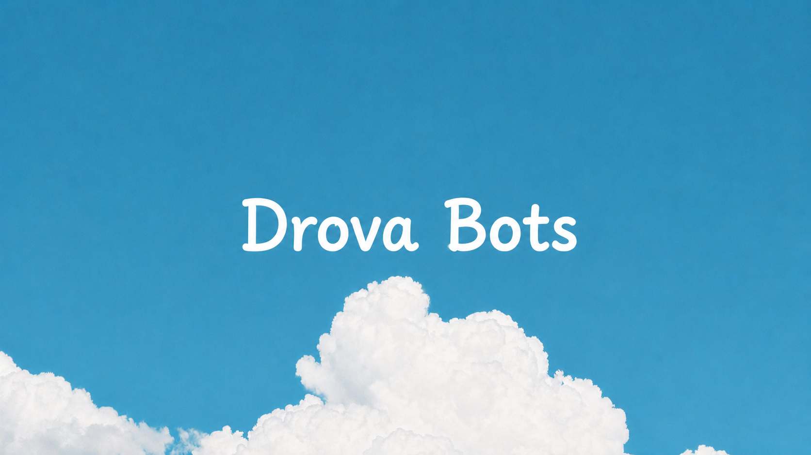

# Drova Bots



## ✦ Features

- ✦ **Animated Theme Toggler:** Integrates MagicUI's animated theme toggler using React's View Transition API for fluid circles, stars, and polygon clips.
- ✦ **Tailwind CSS v4 CSS-Variables:** Full dark and light theme palette support styled entirely through native CSS variables with zero layout shift.
- ✦ **Mobile Optimized:** Responsive layouts with custom flex lines and a minimalist grid designed for screens of all sizes.
- ✦ **Next.js & Turbopack:** Blazing fast loading times and optimized asset delivery out of the box.

## ✦ Featured Bots

1. **Auto Forward Bot:** Automates forwarding of messages across chats/channels with filtering, keywords, and customizable template rules.
2. **Auto Approve Bot:** Instantly processes and approves pending user group/channel joining requests.
3. **Auto Reaction Bot:** Boosts community engagement by automatically reacting with specified emojis to newly sent messages.

## ✦ Getting Started

### Prerequisites

Ensure you have [Node.js](https://nodejs.org) (v18+) and [pnpm](https://pnpm.io/) installed.

### Installation

1. Clone the repository:
   ```bash
   git clone https://github.com/NishulDhakar/telegram-bots-store.git
   cd telegram-bots-store
   ```

2. Install dependencies:
   ```bash
   pnpm install
   ```

3. Run the local development server:
   ```bash
   pnpm run dev
   ```

4. Open [http://localhost:3000](http://localhost:3000) in your browser to view the application.

## ✦ Tech Stack

- **Core Framework:** [Next.js 16 (React 19)](https://nextjs.org/)
- **Styling:** [Tailwind CSS v4](https://tailwindcss.com/)
- **Icons:** [Lucide React](https://lucide.dev/)
- **Transitions:** [Framer Motion](https://www.framer.com/motion/)

---

Built with ✦ by [@Savvyop](https://t.me/savvyop)
